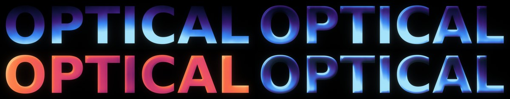
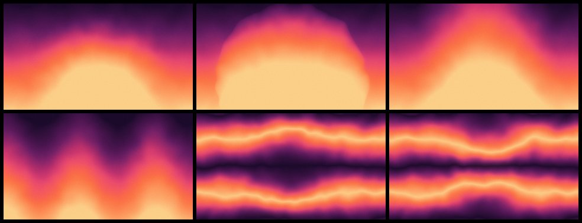

# Cosmic Gradient

A native Adobe After Effects effect plug-in (`.aex`) that paints cinematic
gradients onto shapes and text: curated palettes, a depth field that bends the
colour bands into domes and curves, a glass-like bulge raised from the layer's
own shape, looping turbulence, a lens-like focus falloff, and a glow and
optical diffusion computed in linear light with highlight protection. Written
in C++17.

It is an independent re-creation of the feature set advertised for
[Cosmic by aescripts](https://aescripts.com/cosmic/), built from the public
product description; it shares no code or assets with that product and is not
affiliated with it. The plug-in structure follows
[achimbenzel/greatglow](https://github.com/achimbenzel/greatglow).


```
layer alpha ─► content bounds (sub-pixel) ─► gradient field (type · angle · size · cycles · repeat)
            ─► depth field (dome / sphere / ridge / wave / lens)
            ─► turbulence warp (4D simplex fBm on the content, loops with the angle)
            ─► bulge: glass relief from the blurred alpha (refraction, light, glint)
            ─► palette lookup (Oklab spline) ─► matte & blend with the layer
            ─► focus: variable blur from the focus point outwards
            ─► optical diffusion + glow (pyramids in linear light)
            ─► highlight protection ─► grain ─► dither ─► 8 / 16 / 32 bpc
```

* **Palettes** — 13 curated presets (Deep Space, Nebula, Aurora, Sunset, Solar
  Flare, Ocean, Vaporwave, Ember, Emerald, Rose Gold, Glacier, Eclipse, Mono).
  Picking one fills the five colour controls; editing any colour switches the
  popup to *Custom*. Colours are blended in Oklab with a monotone spline, so
  ramps have even lightness and no Mach bands at the stops.
* **Fits the content** — by default the gradient is laid out on the bounding
  box of the layer's visible pixels, so on a line of text the palette spans the
  text, not the comp-sized layer around it.
* **Depth field** bends the bands into domes, spheres, ridges or waves, or
  magnifies them through a lens (negative depth pinches).
* **Bulge** raises the layer's own shape into a glass-like relief: 0 % is the
  flat gradient, 100 % inflates every letter or shape, bending the gradient
  around its edges like glass, lighting one side and catching a highlight
  along the contour. *Rounding*, *Softness*, *Light Angle* and *Contrast* shape
  it.
* **Turbulence** gives the gradient an organic, imperfect shape. It is
  attached to the content, so a moving layer carries its turbulence with it
  instead of flickering through a still pattern. It holds still unless you
  animate *Evolution*; switch on *Loop With Angle* and **one keyframed Angle
  from 0° to 360° becomes a seamless loop** of both the gradient and the noise.
* **Focus** — everything inside the focus radius stays sharp and everything
  beyond it softens gradually, like a real lens.
* **Glow built for gradients** — radius, falloff and threshold, computed in
  linear light, with **highlight protection** that rolls highlights off along
  the hue instead of burning them to white.
* **Optical diffusion** — a mist-filter veil of the image's own light.
* **Grain** — film-like, strongest in the midtones, optionally animated.
* **GPU accelerated on NVIDIA (CUDA)**, with the CPU renderer as the fallback
  and for everything else. Both produce the same frame.
* 8, 16 and 32 bits per channel, SmartFX, multi-frame rendering, host memory
  and the host thread pool; HDR-safe in 32 bpc.



*Bulge: off, 100 % (Deep Space), 100 % on a radial Sunset, 200 %.*



*Depth shapes: dome, sphere, ridge, wave; the lens, and the lens with negative depth.*


## Installing

The ready-built Windows x64 plug-in is in [`dist/CosmicGradient.aex`](dist/).
Copy it into **one** of

```
C:\Program Files\Adobe\Common\Plug-ins\7.0\MediaCore\
C:\Program Files\Adobe\Adobe After Effects <version>\Support Files\Plug-ins\
```

restart After Effects, and apply **Effect ▸ AB Tools ▸ Cosmic Gradient** to a
text or shape layer. The last group is named after the build
(`v1.2.0 (abc1234)`), so you can confirm which copy is loaded. To update,
replace the file in the same folder while After Effects is closed.

There is no macOS build: that needs Xcode and the Rez resource compiler. The
sources are portable and `tools/generate_pipl.py` also writes the `.r` PiPL a
macOS target needs.

### GPU acceleration

Cosmic Gradient renders on NVIDIA GPUs through CUDA, After Effects' own GPU
path for effects. It needs:

* an NVIDIA GPU from the RTX 20 series (Turing) onwards, and a driver from
  R550 (spring 2024) onwards;
* **File ▸ Project Settings ▸ Video Rendering and Effects ▸ Use: Mercury GPU
  Acceleration (CUDA)**, the default on NVIDIA machines.

The effect then shows After Effects' GPU badge and renders on the card. The
kernels ship as PTX, which the NVIDIA driver compiles for the installed GPU the
first time the effect is used (a second or two, then cached by the driver).

It falls back to the CPU on its own: when the project renders with Mercury
Software Only or OpenCL, when there is no NVIDIA driver, and, frame by frame,
if the GPU runs out of memory or fails. **Performance ▸ GPU Acceleration** turns
the GPU off for one instance.

### Coming from v1.1

Projects saved with v1.0 or v1.1 open with every control holding the value it
was saved with. After Effects matches saved values to controls by their disk
id, not their position, and every id is unchanged; the new controls have new
ids and start where the old look was.

* **Bulge** and its controls are new in the *Depth* group. Bulge starts at 0 %,
  so old projects render flat as before.
* The v1.1 *Depth Shape* entry called *Bulge* is now called **Lens**. It is the
  same shape and old projects that used it keep it.
* **Turbulence is attached to the content.** In v1.1 the noise sat still in
  the layer while the content moved through it (and its scale jumped with the
  content's pixel bounds), which made moving text flicker. Now it travels with
  the content. An existing project shows a different, equally random
  turbulence pattern; change *Random Seed* if you want another one.
* Content bounds are measured to a fraction of a pixel, so the gradient glides
  with moving content instead of stepping a pixel at a time. Static frames can
  differ from v1.1 by that fraction of a pixel.
* *Performance* now comes before the version group.

### Coming from v1.0

* *Loop With Angle* is now **off** for new instances. Instances saved with v1.0
  keep the value they were saved with, so if the noise moves with the angle in
  an older project, untick *Turbulence ▸ Loop With Angle* there.
* *Bulge* is a new fifth entry in *Depth Shape*.
* The new *Performance* group sits after the version group, and *GPU
  Acceleration* is on for old and new instances alike.
* With *Matte: Full Frame* or *Inverted Alpha*, blurs now carry the frame's
  edge on instead of rendering an extra 512 px border around it. That is what
  made defocus slow there. Pixels within a blur's reach of the frame's edge
  can differ very slightly from v1.0; everything else renders exactly as
  before.

### Quick start

1. Apply the effect to a text layer. It fills the text with *Deep Space*.
2. Pick a **Palette**, or edit the five colours.
3. Turn **Angle** to aim the gradient; raise **Depth** to bend it.
4. Raise **Depth ▸ Bulge** to 100 % for glass-like letters.
5. For a loop, tick **Turbulence ▸ Loop With Angle** and keyframe **Angle**
   from 0° to 360° over the loop's length.
6. For a full-frame background, apply it to a solid and set
   **Composite ▸ Matte** to *Full Frame*.

## Parameters

Percentages marked *box* are relative to the reference box (the content bounds,
or the layer with *Fit: Layer*).

| Group | Parameter | Range (default) | What it does |
|-------|-----------|-----------------|--------------|
| Palette | Palette | presets, Custom (Deep Space) | Fills Color 1–5 with a curated palette. |
| | Color 1 … 5 | colour | The palette's stops, first to last. |
| | Color Blend | Oklab Smooth / Oklab / Linear Light / sRGB | How colours between stops mix. *Oklab Smooth* is perceptual with a spline through the stops. |
| | Reverse Palette | off | Runs the palette the other way. |
| Gradient | Type | Linear / Radial / Conic / Diamond / Reflected | Shape of the gradient. |
| | Fit | Content Bounds / Layer | What the gradient is laid out on. The point controls are mapped proportionally onto it. |
| | Center | point (layer centre) | Centre of the gradient. |
| | Angle | angle (180°) | Direction the palette runs (0° = up). With *Loop With Angle*, also drives the turbulence. |
| | Size | 1 – 2000 % (100 %) *box* | One palette length. 100 % spans the box along the gradient (corner to corner for Radial). |
| | Cycles | 0 – 50 (1) | Palette repetitions across the size. |
| | Offset | % (0) | Slides the palette along the gradient. |
| | Repeat | None / Repeat / Mirror | What happens past the palette's ends. Mirror makes cycles seamless. |
| Depth | Depth Shape | Dome / Sphere / Ridge / Wave / Lens | Height map that bends the bands, or (Lens) a lens that magnifies them. |
| | Depth | −1000 – 1000 % (35 %) | How far the bands are pushed, in palette lengths. Negative makes a bowl. For Lens, the magnification; negative pinches. |
| | Depth Center | point (50 %, 72 %) | Centre of the height map. |
| | Depth Radius | 1 – 2000 % (40 %) *box, longer side* | Size of the height map. |
| | Bulge | 0 – 400 % (0 %) | Raises the layer's shape into a glass-like relief. 0 % is flat; 100 % bends the gradient around the shape's edges, lights it and adds a highlight along the contour. |
| | Rounding | 0 – 100 % (100 %) | The relief's profile: 0 % a soft cushion, 100 % a round glass rim that is steep at the edge. |
| | Softness | 1 – 1000 % (100 %) | How far in from the edge the relief rises, relative to the shape's typical stroke width: 100 % rounds each stroke all the way to its middle; lower keeps a flat top with rounded edges. |
| | Light Angle | angle (−45°) | Where the light comes from (0° = top): the walls facing it take later palette colours and the highlight. |
| | Contrast | 0 – 400 % (50 %) | Strength of the light and the highlight. 0 % leaves only the glass bending. |
| Turbulence | Turbulence | 0 – 500 % (5 %) *box, shorter side* | Displacement of the field. The noise is laid out on the content, so it moves with it. |
| | Turbulence Size | 1 – 2000 % (40 %) *box, shorter side* | Scale of the noise. |
| | Complexity | 1 – 8 (3) | Octaves of detail (fractional values fade in). |
| | Evolution | angle (0°) | Evolves the noise; a full turn returns to the start. |
| | Loop With Angle | off | Adds the gradient Angle to the evolution, so animating Angle 0→360° loops the noise too. Off, the noise only moves with Evolution. |
| | Random Seed | 0 – 100000 (0) | Another noise pattern (also seeds the grain). |
| Focus | Focus Point | point (layer centre) | Where the lens is focused. |
| | Focus Radius | % of layer height (25 %) | Sharp inside this radius. |
| | Focus Falloff | % of layer height (50 %) | Distance over which the blur ramps up. |
| | Defocus | 0 – 2000 px (0) | Blur reached at the end of the falloff. 0 turns focus off. |
| Glow | Glow Intensity | 0 – 5000 % (60 %) | Strength of the glow. |
| | Glow Radius | 0 – 4000 px (80) | Size of the glow. |
| | Glow Falloff | 1 – 3 (1.6) | Exponent of the glow's 1/rⁿ profile: lower is wider and softer, higher is a tighter core. |
| | Glow Threshold | 0 – 4 (0.4) | Linear-light brightness where the glow starts. |
| | Threshold Softness | 0 – 100 % (50 %) | Width of the soft knee below the threshold. |
| | Highlight Protection | 0 – 100 % (50 %) | Rolls highlights off along their hue so colours don't burn to white. 0 = clip (and keep HDR in 32 bpc). |
| Optical Diffusion | Diffusion | 0 – 100 % (20 %) | Share of the light spread into a soft veil. |
| | Diffusion Radius | 0 – 2000 px (30) | Size of the veil. |
| Grain | Grain Amount | 0 – 100 % (5 %) | Film grain, strongest in the midtones. |
| | Grain Size | 0.1 – 20 px (1.2) | Grain size. |
| | Animate Grain | off | New grain every frame (the effect then renders every frame even when nothing is keyframed). |
| Composite | Matte | Layer Alpha / Inverted Alpha / Full Frame | Where the gradient goes: into the shapes, around them, or everywhere. |
| | Blend Mode | Normal / Multiply / Screen / Overlay / Color | How the gradient combines with the layer's own colour. *Color* keeps the layer's lightness. |
| | Opacity | 0 – 100 % (100 %) | Mix with the original layer. |
| | Expand Bounds | on | Lets glow, diffusion and defocus spill past the layer's edges. |
| | Working Space | Auto / Linear / sRGB | How pixels are interpreted. Auto: 32 bpc linear, 8/16 bpc sRGB. |
| Performance | GPU Acceleration | on | Render on the GPU when the project uses CUDA. Off renders this instance on the CPU. |

Pixel distances are authored at full resolution and scaled for Half/Quarter
resolution and non-square pixels, so the look holds at every preview
resolution.

### Project compatibility

After Effects finds a saved value by the parameter's disk id, whatever its
position (see the SDK guide's *Changing Parameter Orders, the Nice Way*), so
ids are the saved project format: an id never changes or gets reused, and a
new parameter takes the next free one wherever it sits in the panel. The ids
are in `src/plugin/CosmicParams.cpp`, checked for uniqueness by
`static_assert`. Popups save the chosen entry's position, so their entries are
append only. The match name is `ABBZ CosmicGradient`. On every run the mock
host checks the panel's layout and that every id v1.1 saved is still the same
control, by type and name.

## Layout

| Path | What it is |
|------|------------|
| `src/core/` | Gradient field, palettes, noise, pyramids, compositing, the CPU renderer. No After Effects dependency; builds and is tested on any platform. `Shared.h` holds the per-pixel maths both renderers use. |
| `src/gpu/` | The CUDA kernels, the GPU renderer that drives them, and the PTX the plug-in embeds. |
| `src/plugin/` | After Effects integration: entry point, parameters, SmartFX render, host adapters. |
| `tools/generate_pipl.py` | Builds the PiPL resource, the `.rc` that embeds it, and the shared out-flags header. |
| `tools/build_ptx.py` | Compiles the CUDA kernels to PTX with NVRTC. |
| `tests/` | Core unit tests, an offline preview renderer, and a mock After Effects host that loads the built `.aex`. |
| `cmake/` | SDK discovery and the mingw-w64 cross-compilation toolchain. |
| `dist/` | The built Windows x64 plug-in. |

## Building

You need the Adobe After Effects SDK, which is not in this repository — see
[`third_party/README.md`](third_party/README.md).

### Visual Studio 2022

```bat
cmake -S . -B build -G "Visual Studio 17 2022" -A x64 -DAE_SDK_ROOT="C:/AfterEffectsSDK/Examples"
cmake --build build --config Release
```

The plug-in lands at `build/Release/CosmicGradient.aex`; `cmake --install build
--config Release` copies it to the shared MediaCore folder.

### The CUDA kernels

`src/gpu/CosmicKernelsPtx.h` is generated and committed, so building needs no
CUDA toolkit. After changing `src/gpu/CosmicKernels.cu`, `src/gpu/KernelParams.h`
or `src/core/Shared.h`, regenerate it:

```sh
python3 -m pip install "nvidia-cuda-nvrtc-cu12==12.4.127"
python3 tools/build_ptx.py
```

NVRTC 12.4 is deliberate: its PTX loads on every driver from R550 onwards. The
`ptx_up_to_date` test fails if the header is older than the kernel sources.

### Cross-compiling from Linux

This is how `dist/CosmicGradient.aex` was built and verified:

```sh
sudo apt-get install mingw-w64 wine64
cmake -S . -B build-win -G Ninja -DCMAKE_TOOLCHAIN_FILE=cmake/toolchain-mingw-w64.cmake
cmake --build build-win
ctest --test-dir build-win --output-on-failure   # runs both suites through wine
```

## Testing

```sh
cmake -S . -B build && cmake --build build && ctest --test-dir build --output-on-failure
build/cosmic_preview /tmp/cosmic      # renders reference scenes to PNG
```

* `cosmic_tests` — palettes (stops, no overshoot), the seamless loop, the lens,
  the Bulge relief (flat plateau, lit and shaded walls, every matte and
  resolution), motion (a shape moved inside its layer renders the same pixels
  moved, with turbulence and bulge; content bounds follow sub-pixel moves; the
  canvas's size changes nothing), defaults, bit-depth agreement, transparency
  and premultiplication, glow energy conservation and bounds, full-frame
  edges, Full vs Half resolution, content bounds, repeat modes, dithering, and
  memory balance across every option combination.
* `cosmic_gpu_tests` — the CUDA kernels compiled as C++ and run by an emulator
  (`tests/GpuEmulator.cpp`), driven by the same GPU renderer the plug-in uses,
  against the CPU renderer over 34 scenes: they agree to about 1e-6. Emulated
  device memory starts as NaN, so a kernel reading anything it did not write
  would show.
* `cosmic_mock_host CosmicGradient.aex [dir] [nvcuda.dll]` — loads the built
  plug-in and drives `GLOBAL_SETUP` → `PARAMS_SETUP` → `USER_CHANGED_PARAM` →
  `QUERY_DYNAMIC_FLAGS` → `SMART_PRE_RENDER` → `SMART_RENDER` through stub host
  suites at 8/16/32 bpc, full and half resolution, checking flags, the
  parameter layout and ids, the palette supervision, the rectangles and handle
  balance. Given `tests/FakeCuda.cpp` built as `nvcuda.dll`, it also drives
  `GPU_DEVICE_SETUP` → `SMART_RENDER_GPU` → `GPU_DEVICE_SETDOWN` and checks
  that GPU frames match CPU frames, that a failing GPU falls back to the CPU,
  and that every driver call has the CUDA context current.
* `ptx_up_to_date` — the embedded PTX was built from the current kernels.

The core and the GPU renderer also run clean under AddressSanitizer, UBSan and
ThreadSanitizer.
[docs/testing.md](docs/testing.md) has the checklist for testing inside After
Effects.

## Status and limitations

Verified by the unit tests, the GPU emulator, the mock host (the real `.aex`,
under wine, with a stand-in CUDA driver) and sanitizers, and the PTX is
assembled for Turing, Ampere, Ada and Blackwell (sm_75/86/89/120) with NVIDIA's
`ptxas`. None of this is a real After Effects session on a real NVIDIA GPU, so
work through [docs/testing.md](docs/testing.md) on first install; the GPU items
there are the ones only real hardware can confirm.

* CPU: about 0.15 s for a 1080p full-frame render on 4 cores; defocus no longer
  costs extra on full-frame layers, and about half as much on text. Bulge adds
  about 35 ms for 1080p text with its glow margin.
* GPU: CUDA only. OpenCL, Metal and DirectX projects render on the CPU.
* In 8 and 16 bpc projects rendering on the GPU, *Working Space: Auto* follows
  the bit depth After Effects reports for the render. If colours differ
  between GPU and CPU, set *Working Space* explicitly.
* Windows x64 binary only.
* With *Fit: Content Bounds*, text that animates on changes its bounds, and the
  gradient and turbulence follow. Use *Fit: Layer* to pin them.
* Bulge's relief is measured from the layer's own alpha each frame, so it
  follows moving and morphing content exactly; a relief much wider than the
  canvas margin (over 512 px past it) sees the canvas's edge.
* Blurs are isotropic in render pixels; on non-square-pixel comps they use the
  mean of the two axes.
