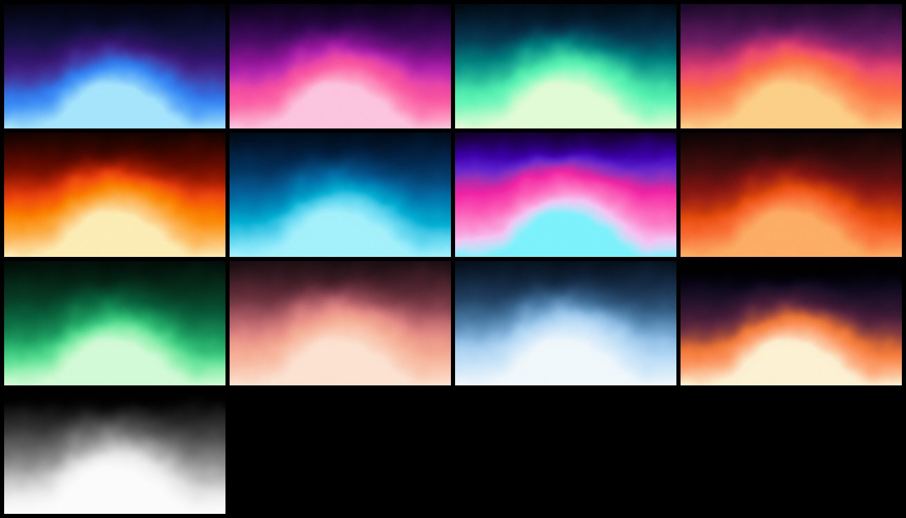
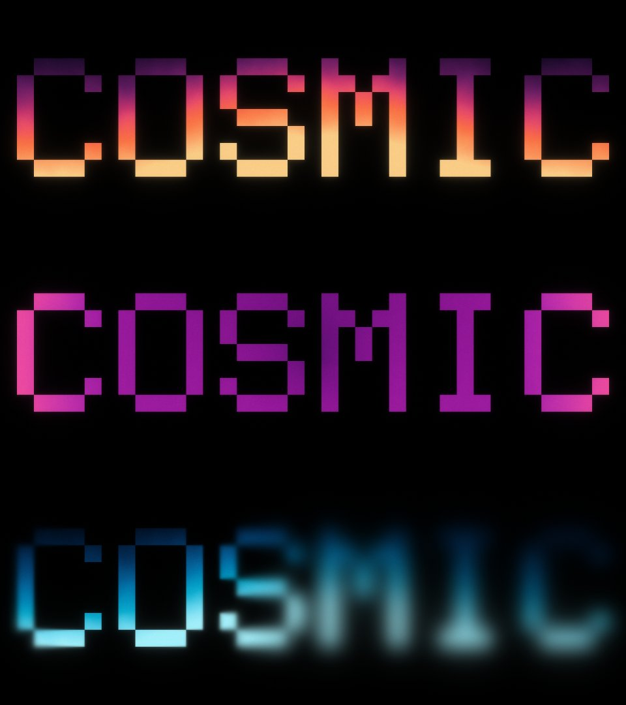

# Cosmic Gradient

A native Adobe After Effects effect plug-in (`.aex`) that paints cinematic
gradients onto shapes and text: curated palettes, a depth field that bends the
colour bands into domes and curves, looping turbulence, a lens-like focus
falloff, and a glow and optical diffusion computed in linear light with
highlight protection. Written in C++17.

It is an independent re-creation of the feature set advertised for
[Cosmic by aescripts](https://aescripts.com/cosmic/), built from the public
product description; it shares no code or assets with that product and is not
affiliated with it. The plug-in structure follows
[achimbenzel/greatglow](https://github.com/achimbenzel/greatglow).



```
layer alpha ─► content bounds ─► gradient field (type · angle · size · cycles · repeat)
            ─► + depth field (dome / sphere / ridge / wave)
            ─► turbulence warp (4D simplex fBm, loops with the angle)
            ─► palette lookup (Oklab spline) ─► matte & blend with the layer
            ─► focus: variable blur from the focus point outwards
            ─► optical diffusion + glow (pyramids in linear light)
            ─► highlight protection ─► grain ─► dither ─► 8 / 16 / 32 bpc
```

* **Palettes** — 13 curated presets (Deep Space, Nebula, Aurora, Sunset, Solar
  Flare, Ocean, Vaporwave, Ember, Emerald, Rose Gold, Glacier, Eclipse, Mono).
  Picking one fills the five colour controls; editing any colour switches the
  popup to *Custom*. Colours are blended in Oklab with a monotone spline, so
  ramps have even lightness and no Mach bands at the stops.
* **Fits the content** — by default the gradient is laid out on the bounding
  box of the layer's visible pixels, so on a line of text the palette spans the
  text, not the comp-sized layer around it.
* **Depth field** bends the bands into domes, spheres, ridges or waves.
* **Turbulence** adds organic drift. Its evolution follows the gradient angle,
  so **one keyframed Angle from 0° to 360° is a seamless loop**.
* **Focus** — everything inside the focus radius stays sharp and everything
  beyond it softens gradually, like a real lens.
* **Glow built for gradients** — radius, falloff and threshold, computed in
  linear light, with **highlight protection** that rolls highlights off along
  the hue instead of burning them to white.
* **Optical diffusion** — a mist-filter veil of the image's own light.
* **Grain** — film-like, strongest in the midtones, optionally animated.
* 8, 16 and 32 bits per channel, SmartFX, multi-frame rendering, host memory
  and the host thread pool; HDR-safe in 32 bpc.



## Installing

The ready-built Windows x64 plug-in is in [`dist/CosmicGradient.aex`](dist/).
Copy it into **one** of

```
C:\Program Files\Adobe\Common\Plug-ins\7.0\MediaCore\
C:\Program Files\Adobe\Adobe After Effects <version>\Support Files\Plug-ins\
```

restart After Effects, and apply **Effect ▸ AB Tools ▸ Cosmic Gradient** to a
text or shape layer. The last group in the effect's controls is named after
the build (`v1.0.0 (abc1234)`), so you can confirm which copy is loaded.

There is no macOS build: that needs Xcode and the Rez resource compiler. The
sources are portable and `tools/generate_pipl.py` also writes the `.r` PiPL a
macOS target needs.

### Quick start

1. Apply the effect to a text layer. It fills the text with *Deep Space*.
2. Pick a **Palette**, or edit the five colours.
3. Turn **Angle** to aim the gradient; raise **Depth** to bend it.
4. For a loop, keyframe **Angle** from 0° to 360° over the loop's length.
5. For a full-frame background, apply it to a solid and set
   **Composite ▸ Matte** to *Full Frame*.

## Parameters

Percentages marked *box* are relative to the reference box (the content bounds,
or the layer with *Fit: Layer*).

| Group | Parameter | Range (default) | What it does |
|-------|-----------|-----------------|--------------|
| Palette | Palette | presets, Custom (Deep Space) | Fills Color 1–5 with a curated palette. |
| | Color 1 … 5 | colour | The palette's stops, first to last. |
| | Color Blend | Oklab Smooth / Oklab / Linear Light / sRGB | How colours between stops mix. *Oklab Smooth* is perceptual with a spline through the stops. |
| | Reverse Palette | off | Runs the palette the other way. |
| Gradient | Type | Linear / Radial / Conic / Diamond / Reflected | Shape of the gradient. |
| | Fit | Content Bounds / Layer | What the gradient is laid out on. The point controls are mapped proportionally onto it. |
| | Center | point (layer centre) | Centre of the gradient. |
| | Angle | angle (180°) | Direction the palette runs (0° = up). Also drives the turbulence loop. |
| | Size | 1 – 2000 % (100 %) *box* | One palette length. 100 % spans the box along the gradient (corner to corner for Radial). |
| | Cycles | 0 – 50 (1) | Palette repetitions across the size. |
| | Offset | % (0) | Slides the palette along the gradient. |
| | Repeat | None / Repeat / Mirror | What happens past the palette's ends. Mirror makes cycles seamless. |
| Depth | Depth Shape | Dome / Sphere / Ridge / Wave | Height map that bends the bands. |
| | Depth | −1000 – 1000 % (35 %) | How far the bands are pushed, in palette lengths. Negative makes a bowl. |
| | Depth Center | point (50 %, 72 %) | Centre of the height map. |
| | Depth Radius | 1 – 2000 % (40 %) *box, longer side* | Size of the height map. |
| Turbulence | Turbulence | 0 – 500 % (5 %) *box, shorter side* | Displacement of the field. |
| | Turbulence Size | 1 – 2000 % (40 %) *box, shorter side* | Scale of the noise. |
| | Complexity | 1 – 8 (3) | Octaves of detail (fractional values fade in). |
| | Evolution | angle (0°) | Evolves the noise; a full turn returns to the start. |
| | Loop With Angle | on | Adds the gradient Angle to the evolution, so animating Angle 0→360° loops everything. |
| | Random Seed | 0 – 100000 (0) | Another noise pattern (also seeds the grain). |
| Focus | Focus Point | point (layer centre) | Where the lens is focused. |
| | Focus Radius | % of layer height (25 %) | Sharp inside this radius. |
| | Focus Falloff | % of layer height (50 %) | Distance over which the blur ramps up. |
| | Defocus | 0 – 2000 px (0) | Blur reached at the end of the falloff. 0 turns focus off. |
| Glow | Glow Intensity | 0 – 5000 % (60 %) | Strength of the glow. |
| | Glow Radius | 0 – 4000 px (80) | Size of the glow. |
| | Glow Falloff | 1 – 3 (1.6) | Exponent of the glow's 1/rⁿ profile: lower is wider and softer, higher is a tighter core. |
| | Glow Threshold | 0 – 4 (0.4) | Linear-light brightness where the glow starts. |
| | Threshold Softness | 0 – 100 % (50 %) | Width of the soft knee below the threshold. |
| | Highlight Protection | 0 – 100 % (50 %) | Rolls highlights off along their hue so colours don't burn to white. 0 = clip (and keep HDR in 32 bpc). |
| Optical Diffusion | Diffusion | 0 – 100 % (20 %) | Share of the light spread into a soft veil. |
| | Diffusion Radius | 0 – 2000 px (30) | Size of the veil. |
| Grain | Grain Amount | 0 – 100 % (5 %) | Film grain, strongest in the midtones. |
| | Grain Size | 0.1 – 20 px (1.2) | Grain size. |
| | Animate Grain | off | New grain every frame (the effect then renders every frame even when nothing is keyframed). |
| Composite | Matte | Layer Alpha / Inverted Alpha / Full Frame | Where the gradient goes: into the shapes, around them, or everywhere. |
| | Blend Mode | Normal / Multiply / Screen / Overlay / Color | How the gradient combines with the layer's own colour. *Color* keeps the layer's lightness. |
| | Opacity | 0 – 100 % (100 %) | Mix with the original layer. |
| | Expand Bounds | on | Lets glow, diffusion and defocus spill past the layer's edges. |
| | Working Space | Auto / Linear / sRGB | How pixels are interpreted. Auto: 32 bpc linear, 8/16 bpc sRGB. |

Pixel distances are authored at full resolution and scaled for Half/Quarter
resolution and non-square pixels, so the look holds at every preview
resolution.

### Project compatibility

Parameter indices and ids are part of the saved project format. They are
frozen in `src/plugin/CosmicParams.h`/`.cpp` and pinned by `static_assert`, so
new parameters can only be appended. The match name is `ABBZ CosmicGradient`.

## Layout

| Path | What it is |
|------|------------|
| `src/core/` | Gradient field, palettes, noise, pyramids, compositing. No After Effects dependency; builds and is tested on any platform. |
| `src/plugin/` | After Effects integration: entry point, parameters, SmartFX render, host adapters. |
| `tools/generate_pipl.py` | Builds the PiPL resource, the `.rc` that embeds it, and the shared out-flags header. |
| `tests/` | Core unit tests, an offline preview renderer, and a mock After Effects host that loads the built `.aex`. |
| `cmake/` | SDK discovery and the mingw-w64 cross-compilation toolchain. |
| `dist/` | The built Windows x64 plug-in. |

## Building

You need the Adobe After Effects SDK, which is not in this repository — see
[`third_party/README.md`](third_party/README.md).

### Visual Studio 2022

```bat
cmake -S . -B build -G "Visual Studio 17 2022" -A x64 -DAE_SDK_ROOT="C:/AfterEffectsSDK/Examples"
cmake --build build --config Release
```

The plug-in lands at `build/Release/CosmicGradient.aex`; `cmake --install build
--config Release` copies it to the shared MediaCore folder.

### Cross-compiling from Linux

This is how `dist/CosmicGradient.aex` was built and verified:

```sh
sudo apt-get install mingw-w64 wine64
cmake -S . -B build-win -G Ninja -DCMAKE_TOOLCHAIN_FILE=cmake/toolchain-mingw-w64.cmake
cmake --build build-win
ctest --test-dir build-win --output-on-failure   # runs both suites through wine
```

## Testing

```sh
cmake -S . -B build && cmake --build build && ctest --test-dir build --output-on-failure
build/cosmic_preview /tmp/cosmic      # renders reference scenes to PNG
```

* `cosmic_tests` — palettes (stops, no overshoot), the seamless loop, bit-depth
  agreement, transparency and premultiplication, glow energy conservation and
  bounds, Full vs Half resolution, content bounds, repeat modes, dithering, and
  memory balance across every option combination.
* `cosmic_mock_host CosmicGradient.aex [dir]` — loads the built plug-in and
  drives `GLOBAL_SETUP` → `PARAMS_SETUP` → `USER_CHANGED_PARAM` →
  `QUERY_DYNAMIC_FLAGS` → `SMART_PRE_RENDER` → `SMART_RENDER` through stub host
  suites at 8/16/32 bpc, full and half resolution, checking flags, the
  parameter layout, the palette supervision, the rectangles and handle balance.

The core also runs clean under AddressSanitizer, UBSan and ThreadSanitizer.
[docs/testing.md](docs/testing.md) has the checklist for testing inside After
Effects.

## Status and limitations

Verified by the unit tests, the mock host (the real `.aex`, under wine) and
sanitizers. It has not yet been run inside a real After Effects session from
this repository's CI, so work through [docs/testing.md](docs/testing.md) on
first install.

* CPU only (SmartFX + the host thread pool); no GPU path yet. About 0.2 s for a
  1080p full-frame render on 4 cores.
* Windows x64 binary only.
* With *Fit: Content Bounds*, text that animates on changes its bounds, and the
  gradient follows. Use *Fit: Layer* to pin it.
* Blurs are isotropic in render pixels; on non-square-pixel comps they use the
  mean of the two axes.
